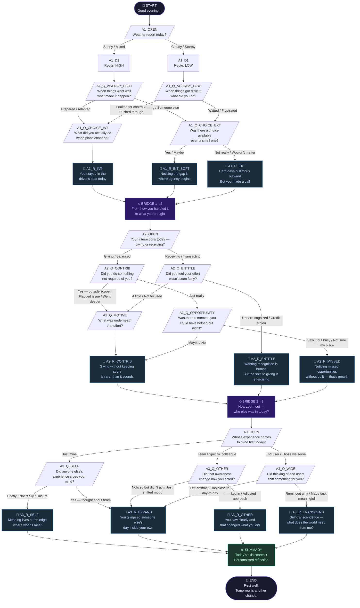

# Daily Reflection Tree — Visual Diagram

## Node Count Summary

| Type | Count |
|------|-------|
| start | 1 |
| question | 12 |
| decision | 9 |
| reflection | 10 |
| bridge | 2 |
| summary | 1 |
| end | 1 |
| **Total** | **36** |

## Axes at a Glance

| Axis | Spectrum | Questions |
|------|----------|-----------|
| Axis 1: Locus | Victim ↔ Victor | A1_OPEN, A1_Q_AGENCY_HIGH/LOW, A1_Q_CHOICE_INT/EXT |
| Axis 2: Orientation | Entitlement ↔ Contribution | A2_OPEN, A2_Q_CONTRIB, A2_Q_ENTITLE, A2_Q_MOTIVE, A2_Q_OPPORTUNITY |
| Axis 3: Radius | Self-Centrism ↔ Altrocentrism | A3_OPEN, A3_Q_SELF, A3_Q_OTHER, A3_Q_WIDE |
